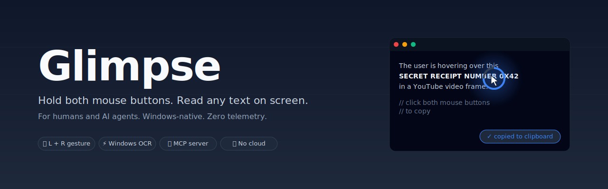

# Glimpse

<p align="center">
  
</p>

> **Hold both mouse buttons. Read any text on screen. For humans and AI agents.**

Glimpse is a Windows-native tool that turns any pixel of text — in videos, images, games, PDFs, browsers, anywhere — into copyable text. Hover over the text, press the left and right mouse buttons together for ~250 ms, and the text is on your clipboard.

It also exposes the same capability as an **[MCP server](docs/MCP.md)**, so AI agents like Claude Code, Cursor, and Cline can "see" your screen on demand.

> The illustration above is a synthetic placeholder. To replace it with a real recording of Glimpse on your desktop, follow [`docs/RECORDING.md`](docs/RECORDING.md). Pull requests with better demo GIFs are very welcome.

## Status

✅ **v0.1.0 shipped** — [Download from GitHub Releases](https://github.com/SS-Companies/glimpse/releases/tag/v0.1.0). Right-click → Properties → Unblock on first run if SmartScreen warns.

## Features (v1)

- **Hold-both gesture** — press L+R mouse buttons for 250ms over any text. Cancels if you move the cursor or release early.
- **Hotkey fallback** — `Ctrl+Shift+C` for accessibility / mice that don't support chord clicks.
- **Editable preview popup** — fixes OCR errors before they hit the clipboard.
- **System tray app** — runs in the background, ~20 MB RAM.
- **MCP server** — built-in. Any agent that speaks MCP can call `ocr_at_cursor`, `ocr_region`, `read_clipboard`.
- **CLI** — `glimpse capture` from any script.
- **Auto-update** — checks GitHub Releases once a day (toggle off in settings).

## Privacy

- **All OCR runs locally** via the built-in Windows OCR API. No image or text ever leaves your machine.
- **No telemetry. No analytics. No crash reports.**
- The only network call is the daily GitHub release check. Toggle off in `%APPDATA%\glimpse\config.json`.
- Local logs at `%APPDATA%\glimpse\logs\daemon.log` (rotating, 7-day retention, max 10 MB). Never auto-sent.

See [`docs/PRIVACY.md`](docs/PRIVACY.md) for the full statement.

## Install

Download the two `.exe` files from the [latest release](https://github.com/SS-Companies/glimpse/releases/latest) and double-click `glimpse-daemon.exe` to start the background gesture listener. The tray icon appears immediately.

```powershell
# Optional: verify the SHA-256 checksums
Get-FileHash glimpse-daemon.exe -Algorithm SHA256
# Compare against glimpse-daemon.exe.sha256 on the Releases page.
```

On first launch Windows SmartScreen will say "unrecognized publisher". Right-click the `.exe` → Properties → tick **Unblock** → OK, then double-click again. Code-signing is on the v1.1 roadmap.

`winget` and `Scoop` manifests will follow in v1.1.

## MCP integration

See [`docs/MCP.md`](docs/MCP.md) for wiring Glimpse into Claude Code, Cursor, and other MCP-compatible agents.

Quick start for Claude Code:

```json
{
  "mcpServers": {
    "glimpse": {
      "command": "glimpse",
      "args": ["mcp"]
    }
  }
}
```

Then the agent can call:
- `ocr_at_cursor()` — read text under the cursor right now
- `ocr_region(x, y, w, h)` — read text in an arbitrary screen region
- `read_clipboard()` — get the current clipboard text

The first call in each session triggers a user permission prompt.

## Building from source

```powershell
git clone https://github.com/SS-Companies/glimpse
cd glimpse
cargo build --release
# Binaries at target\release\glimpse.exe and glimpse-daemon.exe
```

Requirements: Rust 1.80+, Windows 10 1903+ (for the Windows OCR API).

## Architecture

```
crates/
├── core/       # OCR, capture, gesture state machine (lib)
├── daemon/     # tray app, mouse hook, popup UI (bin: glimpse-daemon)
├── mcp/        # MCP server, embedded in daemon (lib + bin)
└── cli/        # glimpse CLI (bin: glimpse)
```

The daemon embeds the MCP server by default — one process runs the tray app, the mouse hook, and the MCP stdio transport.

## License

Dual-licensed under [MIT](LICENSE-MIT) or [Apache-2.0](LICENSE-APACHE), at your option.

## Contributing

See [`docs/CONTRIBUTING.md`](docs/CONTRIBUTING.md). v1 issue list is tracked in GitHub Issues.

If you would like to contribute a better demo GIF, see [`docs/RECORDING.md`](docs/RECORDING.md) for the exact recipe — 5 minutes with ScreenToGif and a single PR.
